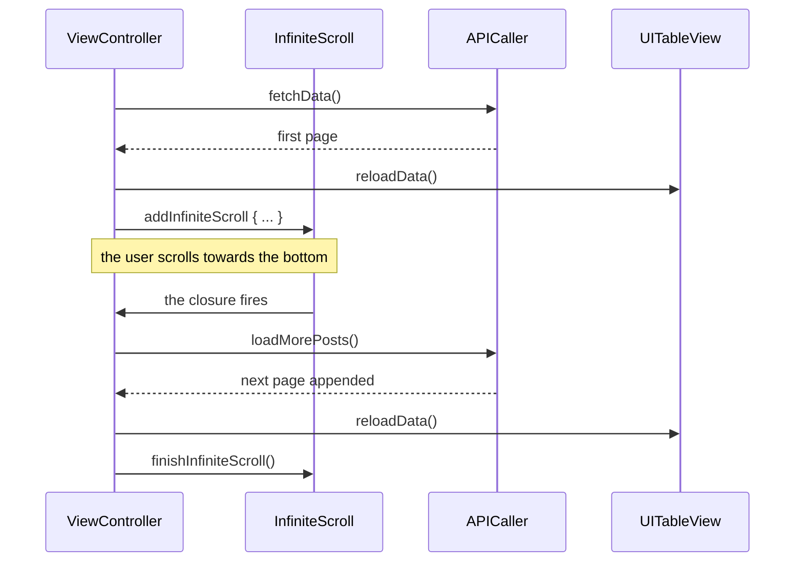

# Infinite Scroll

*Pagination that loads the next page as the list reaches its end.*

    

## Overview

The first page loads on appearance. When the user scrolls near the bottom the next page is requested, appended to the existing rows, and the spinner is dismissed. The trigger and the spinner come from the library, the paging state is the application's own.

## How it works



## Implementation notes

- **finishInfiniteScroll is mandatory.** Forgetting it leaves the spinner on screen and blocks any further trigger, which is the usual bug in this pattern.
- **Append rather than replace.** `loadMorePosts` adds to the existing array so scroll position is preserved across pages.
- **Reload on the main queue.** The completion arrives on a background queue, so the dispatch back is explicit at every call site.
- **Weak self in both closures.** The controller can be dismissed while a page is in flight, and the capture list is what prevents the retain cycle.

## Project structure

```
InfiniteScroll/
├── APICaller.swift        first page and subsequent pages
└── ViewController.swift  table view and scroll trigger
```

## Requirements

Xcode 15 or later, iOS 17.4 or later, Swift Package Manager for UIScrollView-InfiniteScroll.
